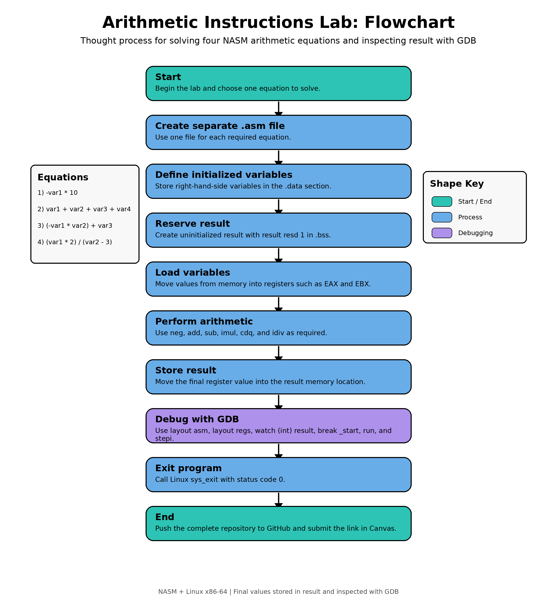

# Arithmetic Instructions in NASM Assembly

## Objective

The objective of this lab is to perform arithmetic instructions in Assembly language using NASM on a Linux platform with Intel x86-64 architecture.

The assignment requires each equation to be completed in a separate file. The right-hand-side variables are initialized in the `.data` section, and the left-hand-side `result` variable is uninitialized in the `.bss` section.

## Equations Completed

| File | Equation | Initialized Variables | Expected `result` |
|---|---|---|---:|
| `equation1.asm` | `result = -var1 * 10` | `var1 = 5` | `-50` |
| `equation2.asm` | `result = var1 + var2 + var3 + var4` | `var1 = 4`, `var2 = 6`, `var3 = 8`, `var4 = 12` | `30` |
| `equation3.asm` | `result = (-var1 * var2) + var3` | `var1 = 7`, `var2 = 3`, `var3 = 20` | `-1` |
| `equation4.asm` | `result = (var1 * 2) / (var2 - 3)` | `var1 = 24`, `var2 = 9` | `8` |

For Equation 4, I chose `var1 = 24` and `var2 = 9` so that the result is an integer:

```text
(24 * 2) / (9 - 3) = 48 / 6 = 8
```

## Repository Contents

| File or Folder | Purpose |
|---|---|
| `equation1.asm` | Assembly code for `result = -var1 * 10` |
| `equation2.asm` | Assembly code for `result = var1 + var2 + var3 + var4` |
| `equation3.asm` | Assembly code for `result = (-var1 * var2) + var3` |
| `equation4.asm` | Assembly code for `result = (var1 * 2) / (var2 - 3)` |
| `flowchart.png` | Flowchart illustrating the arithmetic thought process |
| `docs/flowchart.md` | Text version of the flowchart and thought process |
| `docs/challenges.md` | Written response describing challenges encountered |
| `debug/gdb_commands.md` | GDB commands for debugging the programs |
| `expected_results.txt` | Expected values stored in `result` |
| `output.txt` | Example terminal output from `run.sh` |
| `run.sh` | Script that assembles, links, and runs all four programs |
| `Makefile` | Optional build, run, debug, and clean commands |
| `.gitignore` | Prevents compiled files from being committed |

## Flowchart



## How the Programs Work

Each Assembly program follows the same design:

1. Define initialized variables in the `.data` section.
2. Reserve the uninitialized `result` variable in the `.bss` section.
3. Load initialized values into registers.
4. Perform the required arithmetic instructions.
5. Store the final answer in `result`.
6. Exit the program with the Linux `sys_exit` system call.

The programs do not print output. The lab instructions recommend using GDB to inspect the value of `result`, so each program stores the final arithmetic answer in memory.

## Arithmetic Instructions Used

| Instruction | Purpose |
|---|---|
| `mov` | Move values between memory and registers |
| `neg` | Convert a value to its negative form |
| `add` | Add values |
| `sub` | Subtract values |
| `imul` | Perform signed multiplication |
| `cdq` | Sign-extend `EAX` into `EDX:EAX` before signed division |
| `idiv` | Perform signed division |
| `syscall` | Request Linux system services |

## How to Assemble, Link, and Run One File

Example using `equation1.asm`:

```bash
nasm -f elf64 -g -F dwarf equation1.asm -o equation1.o
ld equation1.o -o equation1
./equation1
```

The program exits silently after storing the final value in `result`.

## How to Build and Run Everything

Using the script:

```bash
bash run.sh
```

Using the Makefile:

```bash
make run
```

Clean compiled files:

```bash
make clean
```

## Debugging with GDB

Example using `equation1`:

```bash
gdb ./equation1
```

Inside GDB:

```gdb
layout asm
layout regs
watch (int) result
break _start
run
stepi
```

The `watch (int) result` command allows GDB to stop when the value stored in `result` changes.

## Expected Results

```text
equation1 result = -50
equation2 result = 30
equation3 result = -1
equation4 result = 8
```

## Challenges Encountered

The main challenge was moving from output-based Assembly to arithmetic-based Assembly. Instead of printing a message to the screen, this assignment required values to be stored in memory and inspected with GDB.

Another challenge was understanding signed arithmetic. The negative equations required `neg` and signed multiplication with `imul`. The division equation required `cdq` before `idiv` so the signed numerator was prepared correctly in `EDX:EAX`.

## Submission

This repository includes the required flowchart, challenge response, GDB debugging notes, expected results, and four separate working Assembly files.
