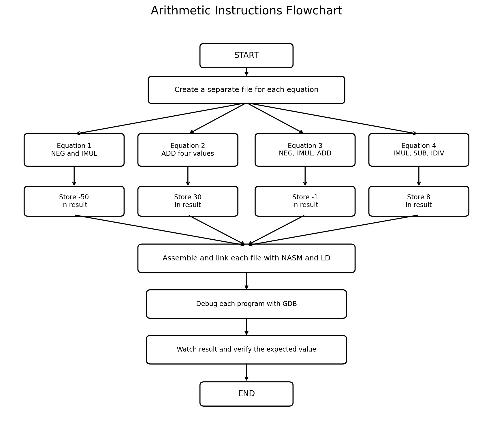

# Arithmetic Instructions

## Objective

Perform arithmetic instructions in 32-bit Intel x86 Assembly language using NASM on Linux.

The assignment requires a separate Assembly file for each equation.

## Flowchart



## Equation 1

```text
result = -var1 * 10
var1 = 5
result = -50
```

The program loads `var1` into `EAX`, uses `NEG` to make it negative, multiplies it by `10` with `IMUL`, and stores the answer in `result`.

## Equation 2

```text
result = var1 + var2 + var3 + var4
4 + 6 + 8 + 12 = 30
result = 30
```

The program loads the first value into `EAX` and adds the remaining initialized variables one at a time.

## Equation 3

```text
result = (-var1 * var2) + var3
(-7 * 3) + 20 = -1
result = -1
```

The program negates `var1`, performs signed multiplication with `IMUL`, adds `var3`, and stores the final value.

## Equation 4

```text
result = (var1 * 2) / (var2 - 3)
var1 = 24
var2 = 9
(24 * 2) / (9 - 3) = 48 / 6 = 8
result = 8
```

The chosen values produce an integer result. `CDQ` prepares `EDX:EAX` for signed division, and `IDIV` stores the quotient in `EAX`.

## Challenges

The main challenge was handling signed arithmetic. The first and third equations require negative values, so `NEG` and signed multiplication with `IMUL` were used.

The division equation required the most planning. The denominator had to be calculated separately, the selected values had to produce an integer, and `EDX:EAX` had to be prepared with `CDQ` before using `IDIV`.

Another challenge was keeping each equation in a separate file while using the same structure: initialized variables in `.data`, the uninitialized `result` variable in `.bss`, and the final answer stored in memory for GDB.

## Compile and Debug

Compile each file separately. Example:

```bash
nasm -f elf32 -g -F dwarf equation1.asm
ld -m elf_i386 -o equation1 equation1.o
gdb equation1
```

Inside GDB:

```gdb
layout asm
layout regs
watch (int) result
break _start
run
stepi
```

Repeat the same process for `equation2.asm`, `equation3.asm`, and `equation4.asm`.

## Expected Results

```text
equation1: result = -50
equation2: result = 30
equation3: result = -1
equation4: result = 8
```
